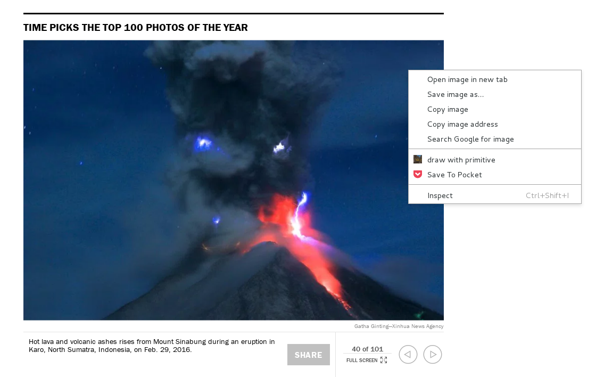
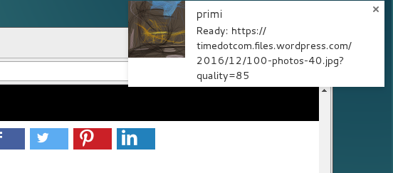
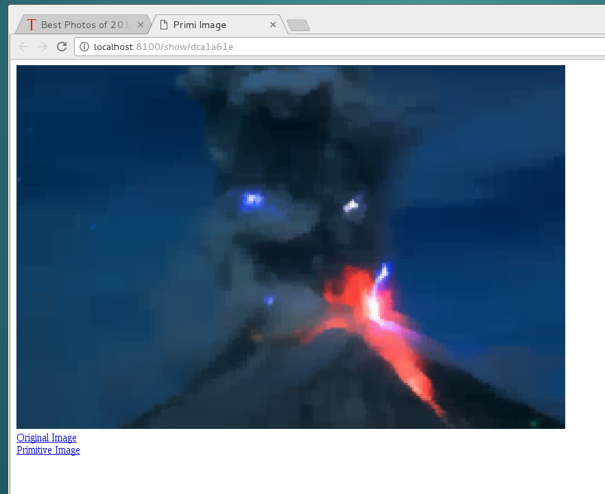

Primi is a chrome extension for [primitive](https://primitive.lol/) and [triangle](https://github.com/esimov/triangle) which are sophisticated image filters. Quoting their use from the corresponding sites

> *Primitive:* The user provides an image as input. The program tries to find the most optimal shape that can be drawn to maximize the similarity between the target image and the drawn image. It repeats this process, adding one shape at a time.
>
> *Triangle:* Triangle is a tool to create image arts using the [delaunay triangulation](https://en.wikipedia.org/wiki/Delaunay_triangulation) technique. It takes an image as input and it converts to abstract image composed of tiles of triangles.

The results are very artistic. For example there is a [twitter bot](https://twitter.com/PrimitivePic) for primitive which you can follow for some great demos.

I like them very much but using the command line apps from github is very tedious. You see a nice image while browsing, download, save as, open terminal, run filter, check console until it finished, open an image viewer for the result etc etc

To make it easier to use i wrote this chrome extension. It has a right click menu option to run primitive or triangle without leaving the browser. The extension also need a local server to run the transformations.

# Installation

1. `go get github.com/anastasop/primi/...` This install the server in `$GOPATH/bin/primiserver`
2. start the server in a terminal console. A script to start it automatically when booting is recommended. I use user level systemd on debian
3. install the chrome extension from `$GOPATH/src/github.com/anastasop/primi/primichrome` If you are familiar with chrome, open the extensions page, set developer mode on and load it from the directory. More detailed instructions [here](https://developer.chrome.com/extensions/getstarted#unpacked). The server has an option for the primiserver. The default is `http://localhost:8100`. If you decide to change it, write the new address, click `Change` and reload the extension.

Now you are ready to use it. Browse the web and find a nice image like this . Right click on it and click `draw with primitive`.

After a while a notification  will appear.

Click it and see the result of primitive 

# TODO

1. All images are stored in server memory and expire after 5 minutes. It would be nice to use some kind of disk storage and an index page
2. Pack the server to run in google cloud engine and the extension for the chrome store
3. Update the screenshots to also show "draw with triangle"

# Bugs

You must reload the extension if you change the server address in options.

# Icon

The icon of the chrome extension is the [Arles Cafe](https://en.wikipedia.org/wiki/Caf%C3%A9_Terrace_at_Night) as is today, filtered with primitive.
Enjoy!

